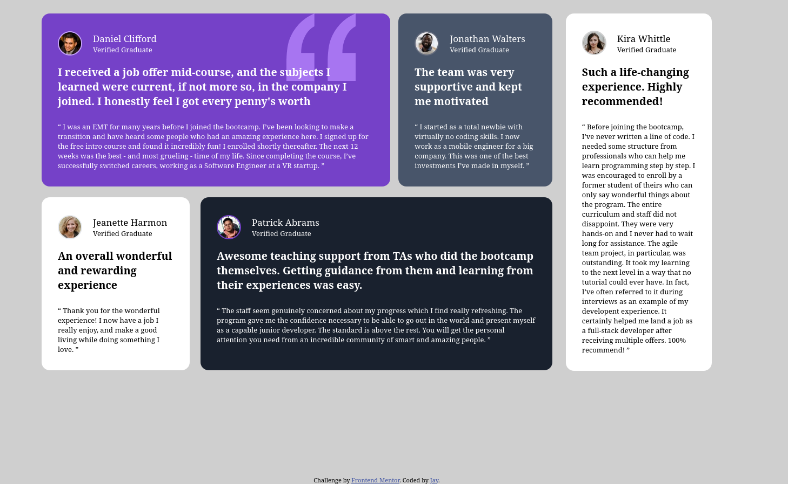

# Frontend Mentor - Testimonials grid section solution

This is a solution to the [Testimonials grid section challenge on Frontend Mentor](https://www.frontendmentor.io/challenges/testimonials-grid-section-Nnw6J7Un7). Frontend Mentor challenges help you improve your coding skills by building realistic projects. 

## Table of contents

- [Overview](#overview)
  - [The challenge](#the-challenge)
  - [Screenshot](#screenshot)
  - [Links](#links)
- [My process](#my-process)
  - [Built with](#built-with)
  - [What I learned](#what-i-learned)
  - [Continued development](#continued-development)
  - [Useful resources](#useful-resources)

## Overview

### The challenge

Users should be able to:

- View the optimal layout for the site depending on their device's screen size

### Screenshot

## Desktop



## Mobile


### Links

- Solution URL: [Solution](https://www.frontendmentor.io/solutions/frontend-mentor---testimonials-grid-section-solution-A3fwAXOgKV)
- Live Site URL: [Live site](https://jainal-5-2.github.io/Frontend-Mentor-Testimonials-grid-section/)

## My process

### Built with

- Semantic HTML5 markup
- Flexbox
- CSS Grid
- Mobile-first workflow

### What I learned

I learned that styling a complicated design design like this can be hard  to make responsive, and needed to break further.

From the start. I htought that I can achieved the design by breaking it into main-container, sub-container1, and sub-container2;

```
<div class='main-container>
  <div class='sub-contaainer1'></div>
  <div class='sub-contaainer2'></div>
</div>
```

Then make the main and sub container 1 a fles box. Then just adjust the width of each testimonial in sub-container1;

```
.main-container{
  display: flex;
  width: 55%;
}

.sub-container1{
  dissplay: flex;
  flex-wrap:wrap;
}

/* Adjust each testimonial in sub-container1 */

```

I learned that it was not possible, at least I was not able to do it. What I ended up doing was spliting the sub-container1 into top and bottom;

```
<div class='main-container>
  <div class='sub-contaainer1'>
    <div class='top'></div>
    <div class='bottom'></div>
  </div>
  <div class='sub-contaainer2'></div>
</div>
```

This made it easy to adjust the top and bottom section separetely, and i was able to achieve the design using the same css. Although it is not so responsive. It breaks upon resize, which I have no idea how to solve.

### Continued development

I'm still lacking the skill to layout complicated design, and to build a responsiveness for these layout is also hard, so i will continue to improve my skill in these area.

### Useful resources

- [MDN](https://developer.mozilla.org/en-US/) - A great documentation for html, css and js.